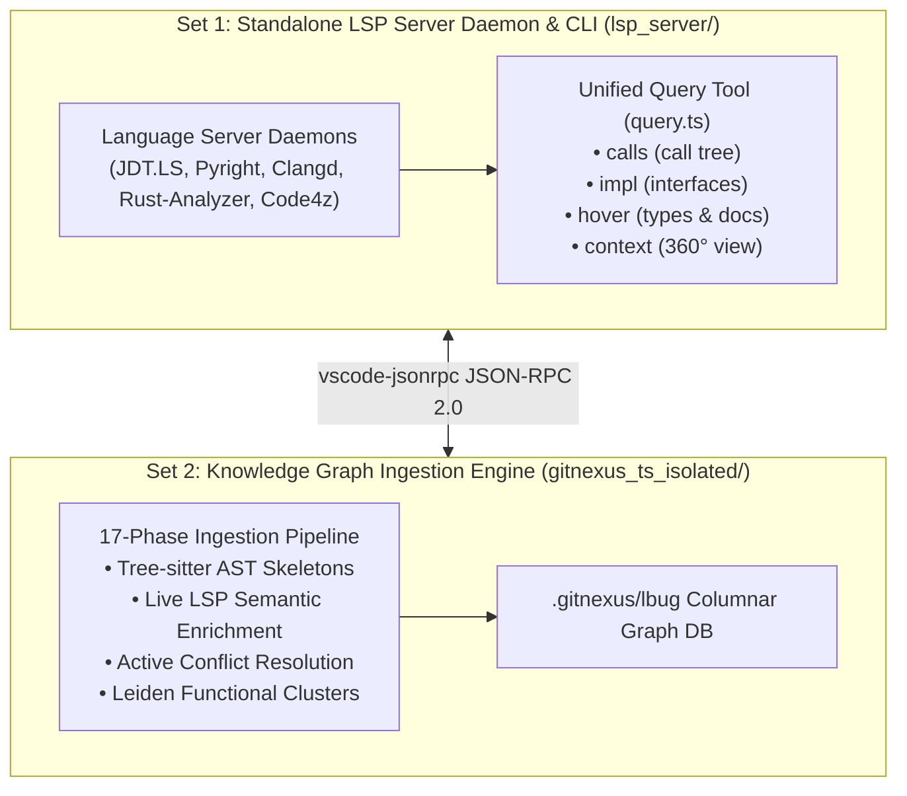

# LSP-Link: Polyglot Banking LSP Engine & Knowledge Graph

[](https://github.com/excitedlybored/lsp_link/actions/workflows/ci.yml)
[](https://opensource.org/licenses/MIT)
[](https://nodejs.org/)
[](https://adoptium.net/)
[](https://microsoft.github.io/language-server-protocol/)

**LSP-Link** provides enterprise-grade code intelligence, standardized retrieval queries, and compiler-verified knowledge graphs across polyglot banking and financial codebases (**Java / Spring Boot**, **COBOL / Mainframes**, **Python / Quant**, **C++ / HFT**, **Rust**, **TypeScript**, and **C#**).

---

## 🌟 Key Architecture & Highlights



1. **Two Distinct Sets of Code**:
   - **Set 1: [`lsp_server/`](file:///Users/zijie-machine/code_ai/ide_link/lsp_server)**: Standalone Language Server process manager and direct JSON-RPC query CLI.
   - **Set 2: [`gitnexus_ts_isolated/`](file:///Users/zijie-machine/code_ai/ide_link/gitnexus_ts_isolated)**: Isolated GitNexus knowledge graph engine with 15+ Tree-sitter parsers and live LSP enrichment.
2. **Polyglot Banking LSP Matrix**:
   - **Java (Spring Boot / Temporal)**: Eclipse JDT.LS + Spring Tools 4.
   - **COBOL (Mainframe / CICS)**: Broadcom Code4z / Che4z + native paragraph/PERFORM AST parser.
   - **Python (Quant / Risk)**: Microsoft Pyright (`pyright-langserver`).
   - **C / C++ (HFT / Order Routing)**: LLVM Clangd.
   - **Rust (Trading Engines)**: Rust-Analyzer.
   - **TypeScript / JS (Portals)**: `typescript-language-server`.
   - **C# (Treasury)**: `csharp-ls` / `OmniSharp`.
3. **Hybrid 2-Tier Ingestion**:
   - **Tier 1 (Tree-sitter)**: Millisecond-fast AST extraction of all files, classes, methods, and line offsets.
   - **Tier 2 (LSP Compiler)**: Resolves dynamic proxies (`Workflow.newActivityStub`), generic overloads (`repo.save(T)`), and polymorphic interfaces (`PaymentGateway`) with 100% compiler precision.
4. **Active Conflict Resolution & Heuristic Pruning**:
   - When compiler ground truth is established, conflicting lower-confidence AST heuristic edges are automatically pruned and replaced.
5. **Resilient Automatic Fallback**:
   - If an external compiler binary is inactive or unavailable, the system silently continues with 100% Tree-sitter AST analysis without failing.

---

## 🚀 Quickstart & Offline Installation

### 1. Zero-Network 1-Step Setup
The repository includes all dependencies in [`vendor/`](file:///Users/zijie-machine/code_ai/ide_link/vendor) (offline `.tgz` and `.whl` archives) and raw source code in [`vendor/packages/`](file:///Users/zijie-machine/code_ai/ide_link/vendor/packages). No internet or external npm registry access is required:

```bash
# Clone repository
git clone https://github.com/excitedlybored/lsp_link.git
cd lsp_link

# 1-Step offline setup (installs Node & Python dependencies 100% from vendor/)
./setup.sh
```

---

### 2. Run Multi-Language Example Tests
Validate all three language testbeds (**Java**, **Python**, **TypeScript**) in 1 command:

```bash
# Test all examples:
npm run test:examples

# Or test any specific example:
npm run boundaries -- examples/01_spring_boot_banking
npm run boundaries -- examples/02_python_fastapi_quant
npm run boundaries -- examples/03_typescript_express_gateway
```

---

### 3. Knowledge Graph Indexing & Ingress/Egress Boundaries
```bash
# 1. Index codebase with live LSP compiler verification:
npm run analyze -- sample_projects/spring-boot-demo

# 2. Ingress & Egress Boundary Analysis:
npm run boundaries -- sample_projects/spring-boot-demo

# 3. View Live GitNexus Graph Node Links (Route -> Method -> Callee -> Sinks):
npm run boundaries:links -- sample_projects/spring-boot-demo

# 4. Inspect End-to-End Business Flows & Execution Paths:
npm run flows -- sample_projects/spring-boot-demo

# 5. List all tracked Ingress/Egress SDK signatures:
npm run sdks:list
```

---

### 4. Direct Polyglot LSP Retrieval Queries
```bash
# 1. Trace Outgoing Call Hierarchy:
npm run query -- calls sample_projects/spring-boot-demo --symbol showExecutionHistory

# 2. Find Concrete Implementations of an Interface:
npm run query -- impl sample_projects/spring-boot-demo --symbol PaymentGateway

# 3. Get 360-Degree Compiler Context:
npm run query -- context sample_projects/spring-boot-demo --symbol DemoWorkflow
```

---

## 📊 Benchmark Results: AST vs. LSP on Enterprise Sample

Tested on [`sample_projects/spring-boot-demo`](file:///Users/zijie-machine/code_ai/ide_link/sample_projects/spring-boot-demo) (augmented with 4 enterprise patterns):

```
========================================================================
📊 Knowledge Graph Difference Summary
========================================================================
| Metric                | Standard AST | LSP-Enriched | Delta     |
|-----------------------|--------------|--------------|-----------|
| Total Nodes           | 421          | 421          | 0 nodes   |
| Total Edges           | 637          | 694          | +57 edges |
| Communities / Clusters| 23           | 22           | 0         |
| Business Flows        | 6            | 5            | 0         |
========================================================================
```

### Key Differences Discovered:
1. **Dynamic Proxy Chaining**:
   ```
   ⚡ [CALLS] OrderFulfillmentWorkflowImpl.processOrder ──► InventoryActivity.reserveInventory
   ⚡ [CALLS] OrderFulfillmentWorkflowImpl.processOrder ──► ShippingActivity.shipOrder
   ```
2. **Method Overload Disambiguation**:
   ```
   ⚡ [CALLS] AuditService.processOrderAudit ──► AuditLogger.log(Order) : void
   ```
3. **Generic Repository Parameter Resolution**:
   ```
   ⚡ [CALLS] AuditService.processOrderAudit ──► GenericRepository.save(T) : T
   ⚡ [CALLS] OrderRepository.saveAll ──► OrderRepository.save(Order) : Order
   ```

---

## 🧠 LadybugDB (`lbug`) Data Structure & Storage

GitNexus persists the knowledge graph inside `.gitnexus/lbug/`. For full technical specifications, see **[`docs/LBUG_DATA_STRUCTURE.md`](file:///Users/zijie-machine/code_ai/ide_link/docs/LBUG_DATA_STRUCTURE.md)**.

### Hybrid Graph Schema:
- **Node Tables**: `File`, `Folder`, `Class`, `Interface`, `Method`, `Function`, `Struct`, `Trait`, `Property`, `Community`, `Process`.
- **Unified Relationship Table (`CodeRelation`)**:
  - `CALLS`, `IMPLEMENTS`, `EXTENDS`, `ACCESSES`, `MEMBER_OF`, `IN_COMMUNITY`, `ENTRY_POINT_OF`, `STEP_IN`.
  - Properties: `confidence: 1.0` (Compiler ground truth) vs `0.6` (AST heuristic), `reason: STRING`.

```cypher
-- Find all compiler-verified vs heuristic method invocations:
MATCH (:Method)-[r:CodeRelation {type: 'CALLS'}]->(:Method)
RETURN r.confidence, count(r) AS totalEdges
GROUP BY r.confidence;
```

---

## 📁 Repository Structure

```
lsp_link/
├── lsp_server/                        # [Set 1] Standalone LSP Server Daemon & Query CLI
│   ├── server_launcher.ts             # Process lifecycle manager
│   ├── start_server.sh                # Launcher daemon script
│   ├── query.ts                       # Unified query CLI (calls, impl, hover, context)
│   └── adapters/                      # Banking language adapters (Java, Pyright, Clangd, etc.)
│
├── gitnexus_ts_isolated/              # [Set 2] Isolated Knowledge Graph Indexing Engine
│   ├── src/lsp/                       # Live LSP enricher & adapter registry
│   ├── src/ingestion/                 # 17-Phase pipeline with automatic fallback
│   ├── src/lbug/                      # LadybugDB columnar graph database
│   └── src/cli/                       # Core analyze CLI tool
│
├── custom_tools/                      # 🛠️ Python Custom Graph Analytics & Boundary Tools
│   ├── ingress_egress_analyzer.py     # Ingress/Egress boundary detector & SDK manager
│   ├── flows_inspector.py             # Business flows, entry points & exit sinks inspector
│   ├── graph_comparator.py            # LadybugDB precision benchmark tool
│   ├── query_db.py                    # Direct LadybugDB OpenCypher query CLI
│   ├── sdk_registry.json              # Declarative Ingress/Egress SDK registry
│   └── README.md                      # Python custom tool developer guide
│
├── language_specs/                    # 📚 Upstream Language & Framework Reference Layers
│   ├── 01_language_server_protocol/   # Eclipse JDT.LS & LSP4J
│   ├── 02_ast_analysis/               # JavaParser AST & Symbol Solver
│   ├── 03_framework_metamodel_spring/ # Spring Tools 4 LSP extensions
│   └── 04_rpc_dynamic_proxy_temporal/ # Temporal Java SDK & Dynamic Proxy Stubs
│
├── sample_projects/                   # 🧪 Benchmark & Sample Repositories
│   ├── spring-boot-demo/              # Enterprise pattern testbed (467 nodes, 785 edges)
│   └── temporal-pause-resume-compensate/
│
├── docs/                              # 📖 Architecture Documentation
│   ├── boundary_analysis/             # 🌐 Ingress & Egress Boundary Specifications
│   │   ├── INGRESS_EGRESS_SPECIFICATION.md # Boundary architecture & LadybugDB graph linking
│   │   └── GENERALISABILITY_ANALYSIS.md    # Polyglot generalisability & enterprise assessment
│   ├── LSP_SERVER_ARCHITECTURE.md     # LSP Server daemon lifecycle & multi-adapter specs
│   └── LBUG_DATA_STRUCTURE.md         # LadybugDB hybrid graph schema & Cypher specs
│
├── .github/workflows/ci.yml           # GitHub Actions CI Workflow
├── package.json                       # Monorepo workspaces & scripts
├── CONTRIBUTING.md                    # Contribution guidelines
└── LICENSE                            # MIT License
```

---

## 📄 License

This project is licensed under the [MIT License](file:///Users/zijie-machine/code_ai/ide_link/LICENSE).
