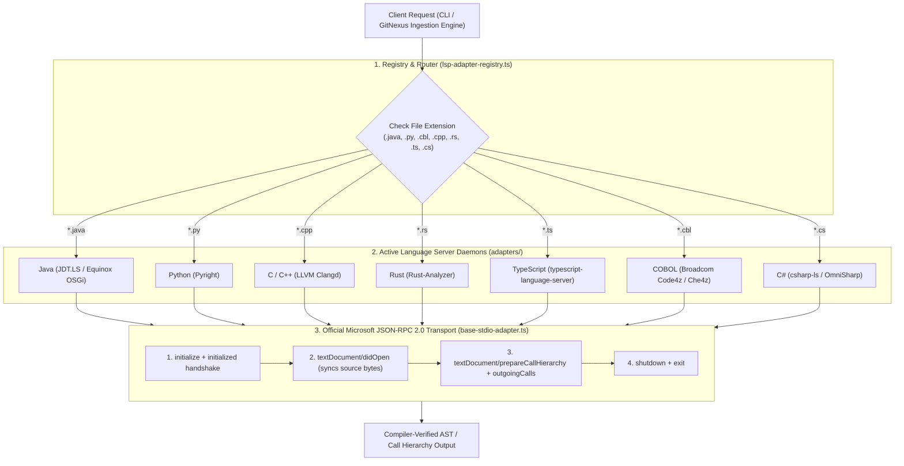

# Language Server Protocol (LSP) Server Architecture & Setup

This document details the internal architecture, lifecycle handshake, and multi-language adapter design of the **IDE-Link LSP Server Engine** ([`lsp_server/`](file:///Users/zijie-machine/code_ai/ide_link/lsp_server)).

---

## 1. High-Level Architecture

The LSP server is implemented as a **pluggable, multi-process daemon architecture** built on the official Microsoft [`vscode-jsonrpc`](https://www.npmjs.com/package/vscode-jsonrpc) and [`vscode-languageserver-protocol`](https://www.npmjs.com/package/vscode-languageserver-protocol) standards.



---

## 2. Core Components

### A. The Base Transport Layer ([`BaseStdioLspAdapter`](file:///Users/zijie-machine/code_ai/ide_link/lsp_server/adapters/base-stdio-adapter.ts))
Handles the low-level JSON-RPC protocol over standard I/O streams using Microsoft's `vscode-jsonrpc`:
- Creates framed stream readers and writers (`StreamMessageReader`, `StreamMessageWriter`).
- Manages request/response promise tracking and timeouts.
- Dispatches notifications without blocking.

```typescript
import * as rpc from 'vscode-jsonrpc/node';

this.connection = rpc.createMessageConnection(
  new rpc.StreamMessageReader(this.process.stdout),
  new rpc.StreamMessageWriter(this.process.stdin)
);
this.connection.listen();
```

---

### B. The Polyglot Registry ([`LspAdapterRegistry`](file:///Users/zijie-machine/code_ai/ide_link/lsp_server/registry/lsp-adapter-registry.ts))
- **Auto-Extension Routing**: Automatically inspects file extensions (`.java`, `.py`, `.cbl`, `.cpp`, `.rs`, `.ts`, `.cs`) and routes requests to the corresponding adapter.
- **Lazy Lifecycle Management**: Starts language daemons on-demand only when a matching file is encountered.
- **Clean Teardown**: Gracefully shuts down all active child processes when operations conclude.

---

## 3. Supported Banking Language Adapters

| Language | Adapter Class | Daemon / Executable | Key Capabilities |
| :--- | :--- | :--- | :--- |
| **Java** | [`JavaJdtlsAdapter`](file:///Users/zijie-machine/code_ai/ide_link/lsp_server/adapters/java/jdtls-adapter.ts) | Eclipse JDT.LS (`org.eclipse.jdt.ls`) | Maven/Gradle multi-module classpath, Spring DI, Temporal stubs |
| **Python** | [`PyrightAdapter`](file:///Users/zijie-machine/code_ai/ide_link/lsp_server/adapters/python/pyright-adapter.ts) | `pyright-langserver --stdio` | Type inference on dataframes, functions, and quant models |
| **C / C++** | [`ClangdAdapter`](file:///Users/zijie-machine/code_ai/ide_link/lsp_server/adapters/cpp/clangd-adapter.ts) | LLVM `clangd` | Template specialization, SIMD intrinsics, HFT call graphs |
| **Rust** | [`RustAnalyzerAdapter`](file:///Users/zijie-machine/code_ai/ide_link/lsp_server/adapters/rust/rust-analyzer-adapter.ts) | `rust-analyzer` | Trait resolution, macro expansion, memory-safe call trees |
| **TypeScript / JS** | [`TypeScriptAdapter`](file:///Users/zijie-machine/code_ai/ide_link/lsp_server/adapters/typescript/typescript-adapter.ts) | `typescript-language-server` | TS interfaces, JSX components, API route handlers |
| **C#** | [`CSharpAdapter`](file:///Users/zijie-machine/code_ai/ide_link/lsp_server/adapters/csharp/csharp-adapter.ts) | `csharp-ls` / `OmniSharp` | `.sln` solution-wide types, LINQ expressions, .NET services |
| **COBOL** | [`CobolAdapter`](file:///Users/zijie-machine/code_ai/ide_link/lsp_server/adapters/cobol/cobol-adapter.ts) | Broadcom Code4z / Che4z | IBM Enterprise COBOL, `COPYBOOK` paths, CICS & DB2 SQL |

---

## 4. End-to-End Protocol Lifecycle

Every LSP interaction follows a 4-step sequence:

```
Client                             LSP Daemon (JDT.LS / Pyright / Clangd)
  │                                           │
  ├─── 1. initialize Request ────────────────►│ (Configures client capabilities)
  │◄─── initialize Response (capabilities) ───┤
  │                                           │
  ├─── 2. initialized Notification ──────────►│ (Server ready)
  │                                           │
  ├─── 3. textDocument/didOpen ──────────────►│ (Syncs file contents into memory)
  │                                           │
  ├─── 4. textDocument/prepareCallHierarchy ─►│
  │◄─── CallHierarchyItem[] ──────────────────┤
  │                                           │
  ├─── 5. callHierarchy/outgoingCalls ───────►│
  │◄─── CallHierarchyOutgoingCall[] ──────────┤
  │                                           │
  ├─── 6. shutdown Request ──────────────────►│
  │◄─── shutdown Response ────────────────────┤
  │                                           │
  └─── 7. exit Notification ─────────────────►│ (Process terminates)
```

---

## 5. Integration with GitNexus Knowledge Graph

When `gitnexus analyze` runs, the **`lspEnrichmentPhase`** invokes the server:

1. **Node Traversal**: Extracts symbol coordinates (`startLine`, `character`) for all methods and classes.
2. **Compiler Resolution**: Queries the appropriate LSP adapter for `CALLS` and `IMPLEMENTS` edges.
3. **Active Conflict Resolution**:
   - Compares compiler-verified targets (`confidence: 1.0`) against existing Tree-sitter heuristic edges (`confidence < 1.0`).
   - Prunes any incorrect AST guesses using `graph.removeRelationship(oldRel.id)`.
   - Injects the compiler ground truth edge into `.gitnexus/lbug`.
4. **Graceful Fallback**: If an external compiler binary is missing, the phase logs a notice and continues with 100% Tree-sitter AST analysis without crashing.

---

## 6. CLI Usage & Query Commands

```bash
# 1. Trace Outgoing Call Hierarchy (e.g. what showExecutionHistory calls):
npm run query -- calls sample_projects/spring-boot-demo --symbol showExecutionHistory

# 2. Trace Incoming Call Hierarchy (e.g. who calls DemoActivitiesImpl):
npm run query -- calls sample_projects/spring-boot-demo --symbol DemoActivitiesImpl --direction incoming

# 3. Find Concrete Implementations of an Interface:
npm run query -- impl sample_projects/spring-boot-demo --symbol PaymentGateway

# 4. Get 360-Degree Compiler Context (Hover, Impl, Incoming/Outgoing Calls):
npm run query -- context sample_projects/spring-boot-demo --symbol DemoWorkflow
```
