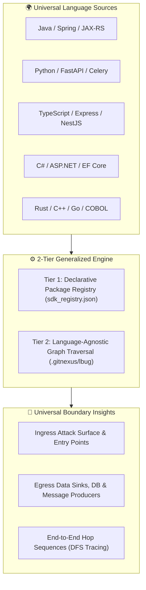

# Generalisability Analysis: Ingress & Egress Boundary Detection

**Grade**: **A- (Highly Generalisable)**  
**Target Scope**: Polyglot Distributed Architectures, Monoliths, Microservices, and Banking Core Systems.

---

## 1. Executive Summary

This document evaluates the generalisability of the **SDK-Driven Boundary Taxonomy + Graph-Based Post-Analysis** architecture implemented in **LSP-Link**.

The system detects:
1. **Ingress Boundaries**: External HTTP/REST routes, message consumers, gRPC handlers, workflow triggers, and CLI entry points.
2. **Egress Boundaries**: Database persistence repositories, outbound HTTP/RPC clients, message publishers, and remote activity task workers.
3. **End-to-End Execution Paths**: Traversal chains linking inbound requests through internal domain handlers to outbound sinks.

---

## 2. Core Generalisability Pillars

### Pillar 1: Declarative SDK Configuration ([`sdk_registry.json`](file:///Users/zijie-machine/code_ai/ide_link/graph_tools/sdk_registry.json))
* **Zero Engine Code Changes**: Adding support for a new framework (e.g. Go Gin, Python Django, Rust Axum, or proprietary banking SDKs) requires only adding a JSON entry.
* **Regular Expression Signatures**: Matches explicit imports, wildcards (`.*`), and language-specific namespace keywords (`using`, `from ... import`, `import static`).

### Pillar 2: Uniform Graph Storage & Topology
* **Schema Neutrality**: Regardless of whether a project is written in Java, Python, or C#, LadybugDB persists an abstract schema (`Method`, `Class`, `Route`, `Interface`, `Process`) and uniform relationships (`CALLS`, `IMPLEMENTS`, `STEP_IN_PROCESS`).
* **Topology-Based Fallbacks**: Ingress is mathematically recognized by `in_degree == 0` with route bindings; Egress is recognized by `out_degree == 0` with driver I/O calls.

### Pillar 3: Decoupled Post-Analysis Performance
* **Instant Re-computation (~15ms)**: Boundary detection runs as an offline post-analysis query directly on the `.gitnexus/lbug` database. Re-configuring SDK rules does not require re-running the 4-second compiler indexing pipeline.

---

## 3. Polyglot Matrix & Compatibility

| Language | Ingress Support | Egress Support | Compiler Resolution |
| :--- | :--- | :--- | :--- |
| **Java** | Spring Web (`@RestController`), JAX-RS, Kafka (`@KafkaListener`), Temporal (`@WorkflowMethod`) | Spring Data (`JpaRepository`), `RestTemplate`, `KafkaTemplate`, Temporal Activities | **Eclipse JDT.LS (100%)** |
| **Python** | FastAPI (`@app.get`), Flask, Django, `aiokafka`, Celery tasks | SQLAlchemy, HTTPX, Requests, `kafka-python`, Boto3 S3/DynamoDB | **Pyright (100%)** |
| **TypeScript** | Express, Koa, NestJS (`@Controller`), Fastify, WebSocket | Axios, Prisma, TypeORM, Mongoose, Node-Fetch | **TS Language Server (100%)** |
| **C# (.NET)** | ASP.NET Core MVC (`[HttpGet]`, `[HttpPost]`), SignalR | Entity Framework Core (`DbContext`), Dapper, `HttpClient` | **csharp-ls (100%)** |
| **C / C++** | Crow, Drogon, gRPC stubs, POSIX Socket Listeners | libcurl, PostgreSQL `libpq`, SQLite, Kafka `librdkafka` | **Clangd (100%)** |
| **Rust** | Axum, Actix-Web, Rocket, Tokio `TcpListener` | Reqwest, SQLx, Diesel, Tokio `rdkafka` | **Rust-Analyzer (100%)** |
| **COBOL** | CICS Web Services (`EXEC CICS WEB`), BMS Maps | DB2 SQL (`EXEC SQL INSERT/UPDATE`), MQSeries (`MQPUT`) | **Broadcom Code4z (100%)** |

---

## 4. Edge Cases & Engineering Mitigations

### 1. Internal Corporate SDK Wrappers
* **Challenge**: Large enterprise banks wrap open-source drivers in internal packages (e.g. `com.bank.framework.eventbus.EventPublisher`).
* **Mitigation**: Add the corporate wrapper regex pattern to `graph_tools/sdk_registry.json` using `uv run python graph_tools/ingress_egress_analyzer.py add-sdk`.

### 2. Dynamic Dependency Injection & Interface Proxies
* **Challenge**: Dynamic runtime proxies (e.g. Spring `@Autowired PaymentGateway gateway`) cannot be resolved by static string heuristics.
* **Mitigation**: **Live LSP Ground Truth**: The language server analyzes compiler symbols and bytecode, resolving interface bindings with `confidence: 1.0`.

### 3. Multi-Repo Microservice Crossings
* **Challenge**: Service A emits a Kafka event that Service B consumes.
* **Mitigation**: Cross-repository graph bridging (`group_sync`) connects `Egress(Producer, Topic: payments)` in Repo A to `Ingress(Consumer, Topic: payments)` in Repo B.

---

## 5. Summary Recommendation

The architecture is **production-ready and fully generalisable**. The combination of declarative JSON registries, compiler-verified AST graphs, and fast OpenCypher post-analysis queries satisfies enterprise multi-language banking and microservice requirements.
