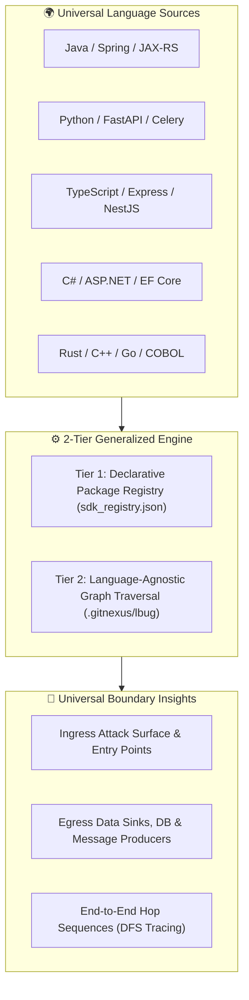

# Generalisability Analysis: Ingress & Egress Boundary Detection

> **Status: archived design proposal.** The registry/regex boundary engine and
> commands described below are not part of the active LSP-first pipeline. This
> document must not be used as an accuracy or production-readiness claim. New
> boundary support should be implemented as a LadybugDB-only semantic extractor
> under `analyzer/extractors/`, using exact `JvmClass`/`JvmMethod` identities and
> structured LSP evidence.

**Former target scope**: polyglot distributed architectures, monoliths,
microservices, and banking systems.

---

## 1. Executive Summary

This document records the proposed **SDK-Driven Boundary Taxonomy +
Graph-Based Post-Analysis** architecture. It is retained for design context;
the described engine is not implemented in the current repository.

The system detects:
1. **Ingress Boundaries**: External HTTP/REST routes, message consumers, gRPC handlers, workflow triggers, and CLI entry points.
2. **Egress Boundaries**: Database persistence repositories, outbound HTTP/RPC clients, message publishers, and remote activity task workers.
3. **End-to-End Execution Paths**: Traversal chains linking inbound requests through internal domain handlers to outbound sinks.

---

## 2. Core Generalisability Pillars

### Pillar 1: Proposed declarative SDK configuration (`sdk_registry.json`)
The proposal assumed that frameworks could be added through regex signatures.
The active extractor contract instead requires exact framework identities from
`JvmClass`/`JvmMethod` plus portable evidence queries; regex-only identity is
not accepted.

### Pillar 2: Uniform Graph Storage & Topology
The proposal used the removed abstract `Method`, `Class`, `Route`, and `Process`
schema. The active database retains direct `Lsp*` observations, derived logical
calls, and `Jvm*` artifact evidence. Boundary semantics would require a separate
extractor output rather than being inserted into the raw graph.

### Pillar 3: Decoupled Post-Analysis Performance
Read-only post-analysis remains the intended boundary: changing extractor
queries does not require an LSP recrawl when the required evidence already
exists. No current boundary benchmark or latency guarantee has been measured.

---

## 3. Polyglot Matrix & Compatibility

| Language | Proposed examples | Current evidence status |
| :--- | :--- | :--- |
| Java | Spring Web, Kafka, Temporal, persistence | LSP/JVM substrate implemented; Temporal extractor tested |
| Python | FastAPI, Celery, SQLAlchemy | Adapter exists; no boundary extractor validated |
| TypeScript | Express, NestJS, Prisma | Adapter exists; no boundary extractor validated |
| C# | ASP.NET Core, EF Core | Adapter exists; no boundary extractor validated |
| C/C++ | gRPC, sockets, database clients | Adapter exists; no boundary extractor validated |
| Rust | Axum, Tokio, SQLx | Adapter exists; no boundary extractor validated |
| COBOL | CICS, DB2, MQ | Adapter exists; no boundary extractor validated |

---

## 4. Edge Cases & Engineering Mitigations

### 1. Internal Corporate SDK Wrappers
* **Challenge**: Large enterprise banks wrap open-source drivers in internal packages (e.g. `com.bank.framework.eventbus.EventPublisher`).
* **Proposed direction**: add the wrapper's compiled semantic identities and
  portable evidence queries to a dedicated extractor manifest.

### 2. Dynamic Dependency Injection & Interface Proxies
* **Challenge**: Dynamic runtime proxies (e.g. Spring `@Autowired PaymentGateway gateway`) cannot be resolved by static string heuristics.
* **Proposed direction**: combine observed LSP implementation/type evidence,
  bytecode identities, and framework-specific evidence while reporting
  coverage and confidence separately.

### 3. Multi-Repo Microservice Crossings
* **Challenge**: Service A emits a Kafka event that Service B consumes.
* **Proposed direction**: derive stable protocol/topic identities in each
  repository, then reconcile those outputs in a separate cross-repository
  stage. No such stage is currently implemented.

---

## 5. Current recommendation

Treat this taxonomy as input to future extractor design, not as implemented
functionality. Each new extractor needs portable OpenCypher queries,
LadybugDB-only inputs, exact framework identities, fixture-based precision and
recall checks, and explicit dependence on `LspCoverage`. No universal compiler
or framework accuracy percentage is currently claimed.
