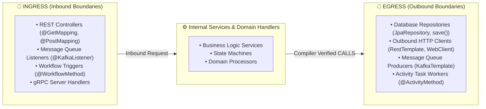

# Ingress & Egress Boundary Architecture Specification

This specification documents the **SDK-Driven Boundary Taxonomy & Graph Linking Engine** implemented in **LSP-Link**.

---

## 1. Boundary Taxonomy



---

## 2. LadybugDB Node Linkage

GitNexus graph nodes directly link to Ingress and Egress points in LadybugDB (`.gitnexus/lbug`):

| Node Type | Graph Label | Boundary Role | Connected Relationships |
| :--- | :--- | :--- | :--- |
| `Route` | `Route` | **Ingress** | `[:HANDLES_ROUTE] ──► (Method)` |
| `Method` | `Method` | **Entry / Step / Exit** | `[:HAS_METHOD] ◄── (Class)`<br>`[:CALLS] ──► (Method)`<br>`[:STEP_IN_PROCESS] ──► (Process)` |
| `Class` | `Class` | **Container / Sink** | `[:IMPLEMENTS] ──► (Interface)`<br>`[:DEFINES] ◄── (File)` |
| `Process` | `Process` | **Execution Flow** | `[:ENTRY_POINT_OF] ◄── (Method)` |

---

## 3. SDK Boundary Registry: [`sdk_registry.json`](file:///Users/zijie-machine/code_ai/ide_link/custom_tools/sdk_registry.json)

The registry defines declarative regex signatures for all tracked third-party SDKs:

```json
{
  "ingress": [
    {
      "id": "spring_web_rest",
      "language": "java",
      "category": "HTTP / REST API",
      "pattern": "\\borg\\.springframework\\.web\\.bind\\.annotation",
      "description": "Spring Web REST Controller (@GetMapping, @PostMapping)"
    },
    {
      "id": "spring_kafka_listener",
      "language": "java",
      "category": "Message Queue Consumer",
      "pattern": "\\borg\\.springframework\\.kafka\\.annotation\\.KafkaListener\\b",
      "description": "Spring Kafka Topic Listener (@KafkaListener)"
    }
  ],
  "egress": [
    {
      "id": "spring_data_jpa",
      "language": "java",
      "category": "Database / JPA Repository",
      "pattern": "\\borg\\.springframework\\.data\\.jpa\\.repository\\b",
      "description": "Spring Data JPA Repository (JpaRepository)"
    },
    {
      "id": "spring_resttemplate",
      "language": "java",
      "category": "Outbound HTTP Client",
      "pattern": "\\borg\\.springframework\\.web\\.client\\.RestTemplate\\b",
      "description": "Spring RestTemplate Outbound Synchronous HTTP Client"
    }
  ]
}
```

---

## 4. CLI Usage & Commands

```bash
# 1. Run Ingress & Egress Boundary Analysis:
npm run boundaries -- sample_projects/spring-boot-demo

# 2. View Live GitNexus Node Links:
npm run boundaries:links -- sample_projects/spring-boot-demo

# 3. List All Tracked Ingress & Egress SDKs:
npm run sdks:list

# 4. Add / Update a Custom SDK Rule:
uv run python custom_tools/ingress_egress_analyzer.py add-sdk \
  --boundary egress \
  --id swift_gateway \
  --lang java \
  --category "Outbound Banking Gateway" \
  --pattern "\bcom\.swift\.iso20022\b" \
  --desc "SWIFT ISO 20022 Payment Gateway"

# 5. Remove an SDK Rule:
uv run python custom_tools/ingress_egress_analyzer.py remove-sdk --boundary egress --id swift_gateway
```
