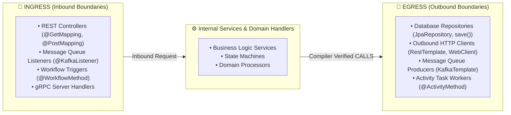

# Ingress & Egress Boundary Architecture Specification

> **Status: archived specification.** The legacy `Route`, `Method`, `Class`,
> `Process`, regex registry, and commands below are not implemented by the
> active LSP-native pipeline. The document is retained as a proposed taxonomy.
> A current implementation should be a LadybugDB-only extractor under
> `analyzer/extractors/` and must use structured LSP/JVM identities.

This specification documents the former proposal for an **SDK-Driven Boundary
Taxonomy & Graph Linking Engine**.

---

## 1. Boundary Taxonomy



---

## 2. Historical proposed LadybugDB node linkage

The removed legacy model proposed linking ingress and egress points through the
following tables. These are not the active `Lsp*`, `Jvm*`, and derived schemas:

| Node Type | Graph Label | Boundary Role | Connected Relationships |
| :--- | :--- | :--- | :--- |
| `Route` | `Route` | **Ingress** | `[:HANDLES_ROUTE] ──► (Method)` |
| `Method` | `Method` | **Entry / Step / Exit** | `[:HAS_METHOD] ◄── (Class)`<br>`[:CALLS] ──► (Method)`<br>`[:STEP_IN_PROCESS] ──► (Process)` |
| `Class` | `Class` | **Container / Sink** | `[:IMPLEMENTS] ──► (Interface)`<br>`[:DEFINES] ◄── (File)` |
| `Process` | `Process` | **Execution Flow** | `[:ENTRY_POINT_OF] ◄── (Method)` |

---

## 3. Proposed SDK boundary registry (`sdk_registry.json`)

The registry defines declarative regex signatures for all tracked third-party SDKs:

```json
{
  "ingress": [
    {
      "id": "spring_web_rest",
      "language": "java",
      "category": "HTTP / REST API",
      "pattern": "\\borg\\.springframework\\.web\\.bind\\.annotation",
      "description": "Spring Web REST Controller (@GetMapping, @PostMapping)"
    },
    {
      "id": "spring_kafka_listener",
      "language": "java",
      "category": "Message Queue Consumer",
      "pattern": "\\borg\\.springframework\\.kafka\\.annotation\\.KafkaListener\\b",
      "description": "Spring Kafka Topic Listener (@KafkaListener)"
    }
  ],
  "egress": [
    {
      "id": "spring_data_jpa",
      "language": "java",
      "category": "Database / JPA Repository",
      "pattern": "\\borg\\.springframework\\.data\\.jpa\\.repository\\b",
      "description": "Spring Data JPA Repository (JpaRepository)"
    },
    {
      "id": "spring_resttemplate",
      "language": "java",
      "category": "Outbound HTTP Client",
      "pattern": "\\borg\\.springframework\\.web\\.client\\.RestTemplate\\b",
      "description": "Spring RestTemplate Outbound Synchronous HTTP Client"
    }
  ]
}
```

---
