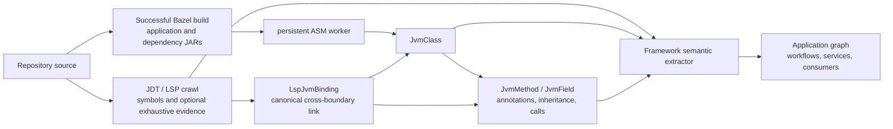

# LSP Indexer

This package owns repository crawling, the LSP-native LadybugDB schema,
artifact enrichment, and persistence.

## Boundary

```text
Language servers
  -> protocol observations
  -> normalized protocol observations
  -> logical-call normalization (derived provenance)
  -> JVM artifact enrichment (separate provenance)
  -> *.lbug
```

The graph stores protocol facts without prematurely mapping symbols into
language-specific approximations.

Bazel preparation also persists a separate configured build graph. Direct
target dependencies, owned sources, and compile/runtime/source artifact roles
use `Bazel*` tables and `BazelRelation`; they are not projected into
`LspRelation` or inferred from flattened JAR paths.

## Crawl planners

`--crawl-planner legacy` retains the original per-document request schedule and
is the default. `--crawl-planner facts-first` separates root-wide declaration
fact collection from semantic-token gap filling. A mapped reference occurrence
is accepted as covering that token position; tokens without such evidence are
still queried for definition, declaration, eligible type/implementation
locations, and hover. Every suppression can be observed through the planner
decision callback, and production runs report covered and queried position
counts per build root.

Facts-first planning starts only after Maven/Gradle/Bazel import and does not
change build-root discovery, classpaths, JDT LS sharding, or JVM artifact
enrichment. Use the repository-level `compare:crawls` command to compare the
semantic inventory in legacy and facts-first crawl checkpoints.

## Node classes

Primary source-identity and compiled-code nodes carry a `codeOrigin` ownership value.
Repository-focused consumers should default to `repository`,
`generated_first_party`, and `first_party_artifact`, while retaining dependency
and standard-library nodes for resolution and explicit traversal. The six
values, classification rules, persistence coverage, and database queries are
defined in [Code-origin classification](../docs/code-origin.md).

| Table | Role |
| --- | --- |
| `LspAnalysisRun` | Workspace, protocol, position encoding, outcome, and run counters |
| `LspServer` | Server identity, language, negotiated capabilities, and status |
| `LspDocument` | Workspace or external URI and content identity |
| `Lsp*Symbol` (26 tables) | One physical node class per standard `SymbolKind`, each with full and selection ranges |
| `LspCallSite` | One precise caller-relative range from call hierarchy `fromRanges` |
| `LspOccurrence` | Definition, declaration, reference, implementation, or type-hierarchy location |
| `LspDiagnostic` | Compiler/language-server diagnostics with exact ranges |
| `LspCoverage` | Query outcome and mapping counts by capability/document/language |
| `LspHover` | Request position, optional result range, content format, and content |
| `LspSemanticToken` | Decoded absolute token position, type, length, and modifiers |
| `LspSignatureHelp` | Request position and active signature/parameter selection |
| `LspSignature` | One structured signature alternative returned by signature help |
| `LspParameter` | Parameter label or offsets, documentation, and ordinal |

## Direct symbol classes

All 26 standard LSP `SymbolKind` values have exact discriminated TypeScript
classes and exact physical LadybugDB node classes. Examples include
`LspPackageSymbol`, `LspFieldSymbol`, `LspEnumMemberSymbol`, `LspEventSymbol`,
and `LspTypeParameterSymbol`; none are folded into `CodeElement`, a generic
`LspSymbol` table, or another approximate class.

`toSymbolRecord()` validates `(kind, kindName)` and selects the concrete table
before persistence, so a `Field` cannot silently be written as a `Property`.
Ladybug's relationship group is correspondingly expanded over all legal
concrete endpoint pairs. This is intentionally more DDL: direct database class
identity takes precedence over schema compactness.

`id` identifies one ranged protocol observation and may change when source
moves. `stableKey` deliberately excludes source coordinates and derives from
the document URI, containment chain, symbol kind, name, and signature. Moving
a class or method within its file therefore preserves semantic identity while
retaining the new observed range.

All positions remain zero-based LSP positions. `LspAnalysisRun.positionEncoding`
records the negotiated unit (`utf-8`, `utf-16`, or `utf-32`). Projection code is
responsible for converting them to another coordinate convention.

## Relationship policy

`LspRelation` preserves the analysis run, server, capability, observation
status, provider authority, and identity-mapping confidence separately.
Provider observations are not destructively replaced when they disagree.

Convenience relationships such as `CALLS` are derived projections; they are
not raw LSP facts. A call is represented natively as:

```text
LspMethodSymbol -[HAS_CALLSITE]-> LspCallSite -[RESOLVES_TO]-> LspFunctionSymbol
```

Every `fromRanges` entry becomes a distinct `LspCallSite`; repeated calls from
one caller to the same callee therefore remain independently queryable.

## Capability compatibility

| LSP capability | Native representation |
| --- | --- |
| Hierarchical document symbols | `LspDocument -[DEFINES]-> Lsp*Symbol -[CONTAINS]-> Lsp*Symbol` |
| Incoming/outgoing call hierarchy | `LspCallSite` per `fromRanges` entry, with direction and capability |
| Implementations | Polymorphic `IMPLEMENTATION_OF` between exact symbol classes |
| Type hierarchy | Neutral `TYPE_HIERARCHY_SUPERTYPE`; no invented extends/implements semantics |
| Definition/declaration/reference | `LspOccurrence` with full target, selection, and origin ranges |
| Hover | `LspHover`, optionally linked to a mapped symbol |
| Diagnostics | `LspDiagnostic` with provider, status, range, severity, code, and tags |
| Semantic tokens | Decoded `LspSemanticToken`, optionally linked to a mapped symbol |
| Signature help | `LspSignatureHelp -> LspSignature -> LspParameter` |

`LspRelation` stores the observation id, run, server, source capability,
mapping status, provider authority, mapping confidence, raw/derived flag,
reason, and ordinal. Multiple provider observations may coexist; disagreement
is represented rather than destructively resolved.

Relation kinds have explicit legal endpoint classes. For example,
`HAS_CALLSITE` only permits a concrete `Lsp*Symbol -> LspCallSite`, while
`IMPLEMENTATION_OF` permits concrete symbol-class pairs. A physically valid but
semantically invalid pair is rejected before persistence.

The LSP schema contains 38 node tables (26 symbol classes plus 12 protocol
observation/support classes) and one relationship table. Logical-call and JVM
artifact stages use their own node and relationship tables.

## Ingestion and persistence

`ingestDocumentSymbols`, `ingestCalls`, and `ingestOccurrence` convert raw
protocol observations into native nodes and endpoint-checked relationships.
`collectCapabilities` executes capability work while preserving the difference
between unsupported, excluded, failed, timed-out, empty, observed, mapped, and
unmapped results in `LspCoverage`.

`LspLadybugRepository` creates the isolated schema and writes an observation
batch in a transaction. Symbols are routed through `toSymbolRecord()` before
insertion, and relations are written only after their concrete endpoint nodes.
`openLspLadybugDatabase()` accepts the installed `@ladybugdb/core` module and a
path such as `.gitnexus/lsp-lbug`; it never opens or modifies `.gitnexus/lbug`.

The standalone adapter now exposes its negotiated server capabilities, raw
request access, canonical document URIs, and buffered notifications. Adapter
orchestration should construct capability tasks from these primitives instead
of treating a swallowed request error as an empty response.

## Development

```bash
npm run build
npm test
```

## Complete JDT LS crawl

The production crawler uses language-server protocol responses directly. It
discovers Java build roots, prepares Bazel project models concurrently, and
distributes roots across a bounded pool of persistent multi-project JDT LS
processes. `--concurrency` selects the shard count. Requests inside each process
remain serialized so one compiler is never flooded.

JDT `documentSymbol` supplies declaration nodes and hierarchy. JDT semantic
tokens then seed usage-level definition, declaration, type-definition,
implementation, and hover requests, so imported types and dependency usages
that are not document symbols are still crawled.

Java primitives and synthetic array `length` have no navigable type
declaration. When JDT LS returns its known malformed empty envelope for those
positions, the Java adapter converts only that exact response to a nullable
empty result. It is counted as successful/empty, not as a capability failure.

```bash
npm run index -- build /path/to/repository \
  --output /path/to/new/lsp-lbug \
  --concurrency 4 \
  --artifact-concurrency 4
```

`--concurrency` controls persistent JDT LS shards. The separate
`--artifact-concurrency` sets parsing threads in the single persistent ASM
worker (default 4, maximum 16). Enrichment reports processed, failed, and total class
counts periodically. `--artifact-max-classes N` can cap detailed parsing when a
complete dependency-bytecode crawl is not required.

Intermediate output is durable and resumable. By default it is written to
`<output>.checkpoints`: one atomic checkpoint per completed build root, then
one for each complete LSP crawl, call-normalization, and JVM-enrichment stage.
The input fingerprint covers Java sources, Bazel/Maven/Gradle build files,
explicit artifact manifests, discovered roots, and stage-affecting options.
Worker-count changes do not invalidate results because they alter scheduling,
not graph semantics. `--checkpoint-directory PATH` relocates the files;
`--no-resume` ignores existing files but records fresh checkpoints.

The output path must not already exist. Every standard semantic capability has
an `LspCoverage` outcome, including unsupported, excluded, empty, partial,
failed, timed-out, observed, mapped, and unmapped results.

Signature-help cursors are found with a Java lexical scan of invocation
delimiters, not an AST. Every location observation retains both the request
URI/position and the response URI/ranges, while each call-hierarchy
`fromRange` remains a separate `LspCallSite`.

## Stage 2: logical-call normalization

Incoming and outgoing call hierarchy can report the same invocation more than
once. This derived stage groups observations by caller, target implementation
family, document, and exact source range. It writes
`LspLogicalInvocation`/`DerivedCallRelation` records while preserving every raw
`LspCallSite`. Ambiguous observations remain explicit rather than being merged.

## Stage 3: JVM artifact enrichment

Artifact enrichment runs only after the LSP crawl has finished. It has its own
`JvmArtifactEnrichmentRun` provenance node, five JVM entity tables, and a
`JvmRelation` table. It never writes bytecode-derived facts into `LspRelation`,
so protocol observations and compiled-artifact observations remain queryably
separate even though they live in the same LadybugDB database.

For every Bazel header JAR on a prepared build-root classpath, the stage:

1. associates the header JAR with its processed/full binary JAR;
2. finds a sibling or local Maven source JAR, or downloads the Maven source JAR
   into the build model's `artifact-sources` cache;
3. creates one `JvmArtifact` and one `JvmClass` per dependency class;
4. seeds bounded ASM traversal from external JDT URIs observed during stage 1;
5. creates separate `JvmMethod`, `JvmField`, and `JvmCallSite` nodes, preserving
   bytecode annotations plus superclass, interface, declaration, and resolved
   bytecode-call relations;
6. parses every unique dependency class without classloading, prioritizing stage-1 seeds, and
   records the dependency logic graph.

`JvmClass` represents a class supplied by a normalized compiled artifact. For
Bazel this includes application-produced JARs from the resolved build scope as
well as external dependency JARs. The crawler inventories each `.class` entry;
vendored ASM then statically observes compiled bytecode and metadata to recover
methods, fields, annotations, inheritance, and bytecode-level calls. Those
facts connect application and dependency classes directly, while LSP bindings
optionally connect source observations to canonical `JvmClass` or `JvmMethod`
identities. ASM reads artifacts only; it never executes application or
dependency code.

The combination supplies the cross-boundary link required for framework-aware
analysis: the JVM graph provides scalable application annotations,
implementations, and resolved bytecode calls together with the referenced
framework API. LSP can add exact source ranges and protocol-derived evidence.
A framework extractor can derive concepts such as Temporal workflows, Spring
services, and Kafka consumers without relying on application naming or layout.



Original classpath JAR basenames remain as artifact aliases after files move to
the content-addressed cache. This allows JDT external URIs to resolve to the
correct `JvmClass`. `LspJvmBinding` then links hovers, external symbols, and
occurrences to `JvmClass` or an unambiguous `JvmMethod` without mixing derived
artifact evidence into `LspRelation`.

The default is a complete dependency-class crawl. For exceptionally large
repositories, opt into a bounded seed-reachable logic crawl with
`--artifact-max-classes N`; reaching that bound records
`status=partial,truncated=true`. Class inventorying itself is never limited.
Source acquisition is on by default and can be disabled for an offline run with
`--no-artifact-source-fetch`. Missing source artifacts remain explicit as
`sourceOrigin=unavailable` and `associationStatus=binary_only`; this does not
discard the binary graph.

Seed classes retain the exact stage-1 external URIs in `JvmClass.seedUris`.
This provides an auditable join back to the LSP observation; the structural
join is persisted separately as `LspJvmBinding`, never as `LspRelation`.

### General artifact-classpath boundary

`ArtifactClasspathProvider` isolates build/import discovery from bytecode
enrichment. Every provider emits the same `NormalizedArtifactDescriptor`:
build-root ownership, provider identity, scope, classpath/module-path status,
coordinate, and optional header, full-binary, and source JAR paths.

The default resolver contains:

| Provider | Authority |
| --- | --- |
| `bazel-java-info` | `JavaInfo` compile-time and runtime JARs from the generated external model |
| `maven-m2e` | Runtime classpath imported by M2E into JDT LS |
| `gradle-buildship` | Runtime classpath imported by Buildship into JDT LS |
| `jdt-ls` | Generic fallback through `java.project.getClasspaths` |
| `explicit-manifest` | User-supplied normalized classpath manifest |

Maven and Gradle providers intentionally query JDT LS after import instead of
running Maven or Gradle again. The JDT extension commands are invoked through
`workspace/executeCommand`; all imported projects returned by
`java.project.getAll` are queried, including module paths. Provider evidence is
merged when a mixed build root reports the same JAR through M2E and Buildship.

The implementation is grouped by responsibility under `src/artifact/classpath`:

- `types.ts` contains only the public provider contracts and normalized model;
- `jdt-runtime-classpath.ts` owns JDT LS extension-command access;
- `descriptor-normalizer.ts` normalizes and merges JAR identities;
- `providers.ts` contains build-system and manifest adapters;
- `resolver.ts` selects providers, memoizes shared JDT work, and records attempts.

The separate `src/artifact/enrichment.ts` stage consumes only normalized
descriptors and has no knowledge of Maven, Gradle, Bazel, or JDT import policy.

An explicit manifest can be placed at
`.gitnexus/artifact-classpath.json`, passed repeatedly with
`--artifact-classpath-manifest /path/to/manifest.json`, or configured through
`GITNEXUS_ARTIFACT_CLASSPATH_MANIFEST`. It accepts either `classpath` strings or
structured `artifacts` entries:

```json
{
  "artifacts": [{
    "classpathEntryPath": "lib/header_demo.jar",
    "headerJarPath": "lib/header_demo.jar",
    "binaryJarPath": "lib/demo.jar",
    "sourceJarPath": "lib/demo-sources.jar",
    "coordinate": "example:demo:1.0",
    "scope": "runtime",
    "modulePath": false
  }]
}
```
